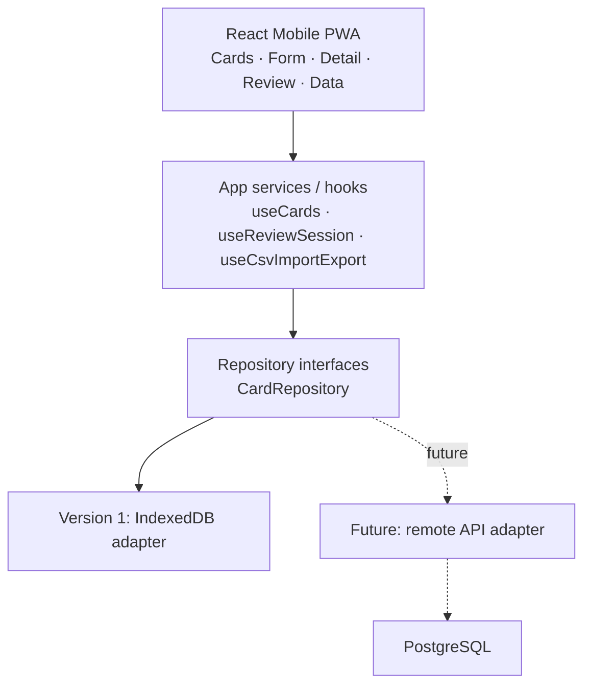

# Flashcard PWA Design

Date: 2026-06-25
Status: Approved draft for implementation planning

## Summary

Build a mobile-first React flashcard application for Thai and English learning. The first version is a local-first Progressive Web App (PWA): it works offline, stores data in IndexedDB, and can be installed on a mobile home screen. The implementation should remain friendly to a future migration to remote PostgreSQL by using UUIDs, timestamped records, soft deletion, and a repository/data-adapter boundary.

## Goals

- Create, edit, view, search, and delete flashcards.
- Support mixed Thai and English terms in a single card model.
- Store phrase/word, meaning, any number of example sentences, notes, tags, and optional source.
- Provide a basic review mode with card reveal and `Know` / `Again` actions.
- Support CSV import and export for backup, migration, and bulk editing.
- Run well on mobile screens and support offline use as a PWA.
- Keep the persistence layer replaceable so PostgreSQL-backed sync can be added later.

## Non-goals for Version 1

- User accounts, login, or cloud sync.
- Remote PostgreSQL connection or backend API.
- Full spaced repetition scheduling.
- Automatic duplicate merging during import.
- Multi-language UI. The app interface will be English.

## Product Decisions

- App type: local-first mobile PWA.
- UI language: English.
- Main screen: card list first.
- Card model: single generic `term` field rather than fixed Thai/English columns.
- Review front side: show only the `term`; reveal displays meaning, examples, and notes.
- Import/export: CSV in version 1.
- Future migration target: remote PostgreSQL, through a later API or service such as Supabase.

## Architecture

Use React, Vite, and TypeScript. The UI should not directly depend on IndexedDB. Instead, the app uses service/hooks that talk to repository interfaces. Version 1 supplies an IndexedDB adapter; future versions can add a remote adapter for PostgreSQL-backed persistence.



### Main Units

- UI components: render screens and handle user interaction.
- App services/hooks: coordinate validation, repository calls, and view state.
- Repositories: define persistence methods independent of storage technology.
- IndexedDB adapter: implements repositories using local browser storage.
- CSV utilities: parse, validate, preview, import, and export cards.
- Review utilities: build review sessions and update review statistics.

## Data Model

### `cards`

- `id: string` — UUID.
- `term: string` — phrase or word, in Thai, English, or another language.
- `meaning: string` — user-entered meaning.
- `examples: string[]` — zero or more example sentences.
- `notes: string` — free-form notes.
- `tags: string[]` — labels such as `thai`, `english`, `travel`, or `verb`.
- `source?: string` — optional source/reference.
- `createdAt: string` — ISO datetime.
- `updatedAt: string` — ISO datetime.
- `deletedAt: string | null` — soft delete marker.

### `review_stats`

- `cardId: string` — UUID matching `cards.id`.
- `reviewCount: number`.
- `knownCount: number`.
- `unknownCount: number`.
- `lastReviewedAt: string | null` — ISO datetime.

Version 1 updates aggregate stats only. A later version can add a `review_events` table for detailed history and spaced repetition.

## CSV Import and Export

CSV columns:

```text
term,meaning,examples,notes,tags,source
```

Rules:

- `term` and `meaning` are required.
- `examples` can contain multiple examples separated by newlines or ` | `.
- `tags` are comma-separated.
- Import generates `id`, `createdAt`, and `updatedAt`.
- Import first shows a preview and validation errors before writing data.
- Duplicate terms are allowed in version 1.
- Export includes non-deleted cards.

## Mobile Screens and Flows

### Cards

The main screen prioritizes card management:

- Search across term, meaning, examples, and notes.
- Filter by tags.
- Show compact card rows with term and meaning preview.
- Provide prominent `+ Add` and `Start Review` actions.

### Add/Edit

- Fields: term, meaning, examples, notes, tags, source.
- Examples are repeatable multiline entries.
- Validate required fields before save.
- Save returns to the list or detail screen.

### Card Detail

- Shows full term, meaning, examples, notes, tags, source, and review stats.
- Offers edit and delete actions.
- Delete sets `deletedAt` instead of removing the record physically.

### Review

- Starts from the current non-deleted card set, optionally affected by search/tag filters later.
- Front side shows only the term.
- User taps to reveal meaning, examples, and notes.
- `Know` increments `reviewCount` and `knownCount`.
- `Again` increments `reviewCount` and `unknownCount`.
- Both actions update `lastReviewedAt`.

### Settings / Data

- Import CSV.
- Export CSV.
- Explain that data is stored locally on this device/browser and should be exported for backup before clearing browser data or changing devices.

## Error Handling

- Form validation blocks empty `term` or `meaning`.
- CSV import reports row-level errors and does not commit invalid rows until the user confirms the valid preview.
- IndexedDB initialization failure shows a clear storage error, including possible causes such as private browsing mode or blocked site storage.
- Soft deletion reduces the risk of accidental permanent data loss and supports future sync conflict handling.

## Offline and PWA Behavior

- Generate a web app manifest and service worker.
- Cache the application shell so it can launch offline.
- Store user data in IndexedDB.
- Support installation to mobile home screen.
- Avoid network dependency in version 1.

## Testing Strategy

### Unit Tests

- Card model creation and update timestamp behavior.
- Repository contract behavior using the IndexedDB adapter.
- CSV parse, validate, import mapping, and export serialization.
- Review stat updates for `Know` and `Again`.

### Component Tests

- Card form validation and repeatable examples.
- Card list search and tag filtering.
- Review reveal state and action buttons.

### End-to-End Smoke Test

- Add a card.
- Search for it.
- Review it and mark `Know` or `Again`.
- Export CSV and verify the card appears.

## Future PostgreSQL Migration Notes

The version 1 schema and boundaries should make migration straightforward:

- UUID primary keys already match remote-friendly records.
- `createdAt`, `updatedAt`, and `deletedAt` support sync and conflict resolution.
- Repository interfaces isolate UI from storage details.
- CSV export provides an immediate manual migration path.
- A future remote adapter can map `cards` and `review_stats` to PostgreSQL tables.
- If detailed review history is needed, add `review_events` without breaking the existing aggregate stats.

## Acceptance Criteria for Version 1

- The app runs locally as a React PWA and is usable on a mobile-width viewport.
- Users can create, edit, view, search, tag-filter, and soft-delete cards.
- Users can add any number of examples to a card.
- Users can review cards by revealing the answer and choosing `Know` or `Again`.
- Review statistics persist locally.
- Users can import and export CSV.
- The app can open without network access after the initial load.
- Persistence is accessed through repository interfaces, not directly from UI components.
